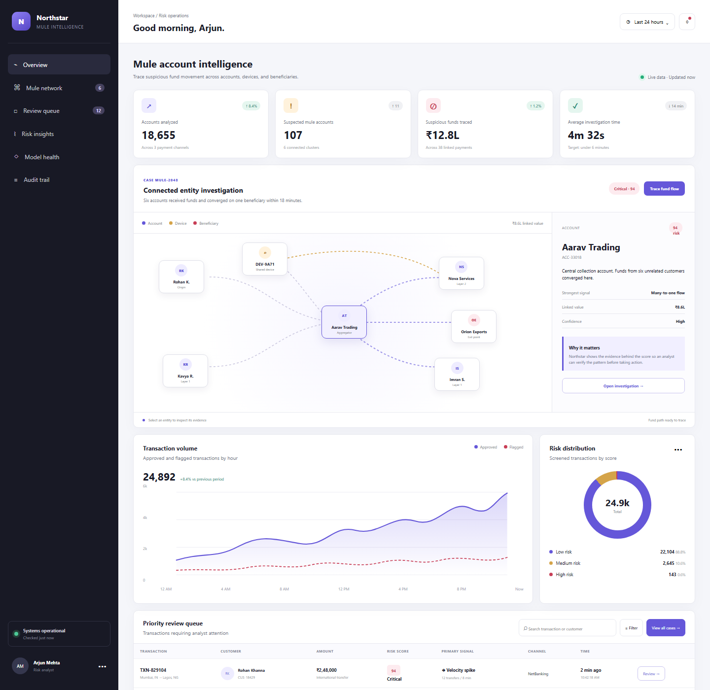

# Northstar Mule Account Intelligence

Northstar is an interactive fintech risk-operations demo that helps analysts investigate suspected mule-account networks. It connects transactions, customer accounts, devices, and beneficiaries in an explainable entity graph, then supports case review and auditable decisions.



## The problem

Traditional transaction queues show alerts one row at a time. Mule activity is often distributed across several accounts, shared devices, rapid pass-through transfers, and a common beneficiary. Northstar groups those clues into one investigation so an analyst can understand the network instead of reviewing isolated alerts.

## What the demo includes

- Interactive entity network for accounts, devices, and beneficiaries
- Animated fund-flow tracing across a suspicious account cluster
- Explainable risk scores with the strongest signal and linked value
- Transaction monitoring metrics and risk distribution
- Searchable, risk-filtered analyst review queue
- Case review with safe or block-and-escalate decisions
- Model precision, recall, false-positive, and audit indicators
- Responsive layout for desktop and mobile

## Run locally

No installation is required. Clone the repository and open `index.html` in a modern browser.

```bash
git clone https://github.com/dmohanofficial07-ship-it/northstar-mule-intelligence.git
cd northstar-mule-intelligence
```

## Project structure

```text
.
├── index.html        Dashboard structure and synthetic investigation data
├── styles.css        Responsive design, graph styling, and visual system
├── script.js         Graph interaction, filtering, case review, and animations
├── assets/           Repository screenshots
└── docs/             Project documentation
```

## BFSI concepts demonstrated

- Mule-account detection
- Transaction monitoring
- Account-link analysis
- Fraud and AML case investigation
- Explainable risk scoring
- Analyst decision auditability
- Model-quality monitoring

## Production evolution

A production version would use an event stream, graph database, rules and model-serving APIs, case-management services, role-based access control, maker-checker approval, encryption, immutable audit records, and ongoing model governance.

## Data notice

Every customer, account, transaction, score, and decision in this repository is synthetic. The demo does not connect to a bank, process payments, or make real risk decisions.

## License

MIT
