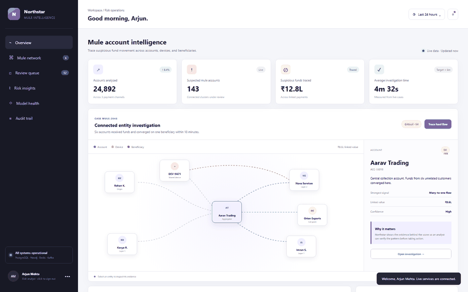
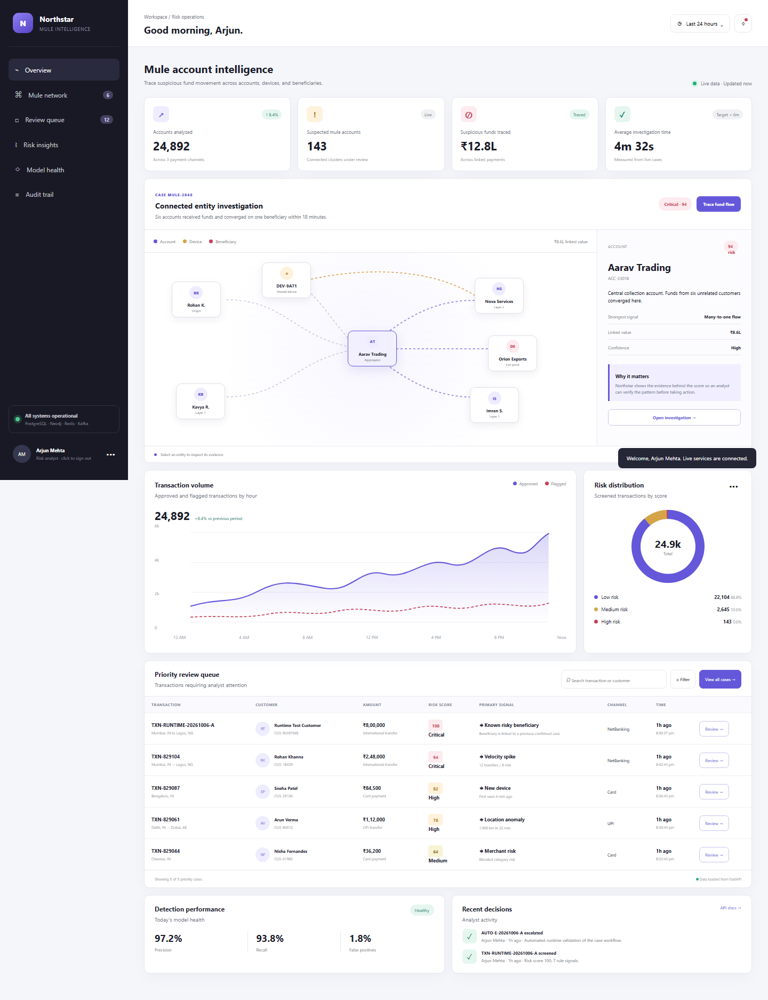
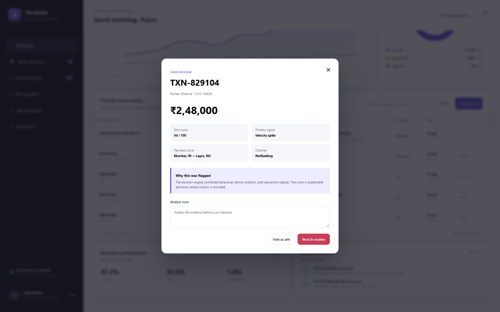
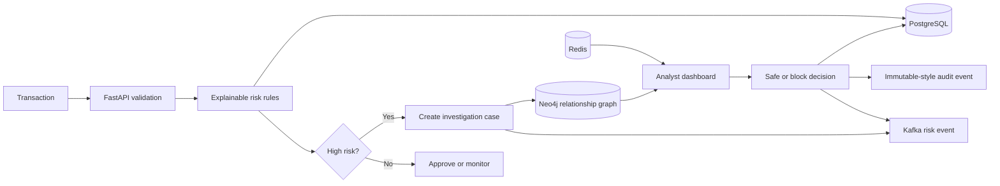

# Northstar Mule Account Intelligence

Northstar is a full-stack fintech risk-operations application for investigating suspected mule-account networks. It screens transactions with explainable rules, connects accounts, devices and beneficiaries in a graph, gives analysts a priority queue, and stores every case decision in an audit trail.

<p align="center">
  
</p>

<p align="center"><em>Live dashboard, graph tracing, priority queue and explainable case review.</em></p>

## Why this project exists

Traditional transaction queues show alerts one row at a time. Mule activity is often distributed across several accounts, shared devices, rapid pass-through transfers and a common beneficiary. Northstar brings those clues into one investigation so an analyst can review the network and the evidence behind its risk score.

This repository contains a working application stack. All included customers and transactions are synthetic, but authentication, API calls, persistence, rule execution, graph storage, caching, event publication and audit recording are implemented as real application behavior.

## Product tour

### Live risk-operations dashboard



The dashboard combines live service health, operational metrics, a Neo4j-backed mule network, the risk-prioritized transaction queue and recent audit activity. The captured data is synthetic.

### Explainable analyst decision



Analysts see the score, strongest signal, payment route and channel before recording a safe or block-and-escalate decision with a required note.

## Technology stack

| Layer | Technology | Responsibility |
|---|---|---|
| Frontend | HTML, CSS, vanilla JavaScript | Responsive analyst workspace and API client |
| API | Python 3.12, FastAPI, Pydantic | Authentication, validation and business endpoints |
| Relational data | PostgreSQL 16, SQLAlchemy, Alembic | Transactions, cases, decisions, users and audit events |
| Graph data | Neo4j 5 | Account, device and beneficiary relationships |
| Cache | Redis 7 | Dashboard response caching |
| Events | Apache Kafka 3.8 | Transaction-screening and case-decision events |
| Security | JWT, Argon2, role field | Authenticated analyst access and password hashing |
| Delivery | Docker Compose, GitHub Actions | Reproducible local environment and CI checks |

## Run the complete application

Install Docker Desktop, then run:

```bash
git clone https://github.com/dmohanofficial07-ship-it/northstar-mule-intelligence.git
cd northstar-mule-intelligence
docker compose up --build
```

Open these URLs after the containers become healthy:

- Application: <http://localhost:8000>
- Swagger API documentation: <http://localhost:8000/docs>
- API health: <http://localhost:8000/api/health>
- Neo4j Browser: <http://localhost:7474>

Use the seeded analyst account:

```text
Email: analyst@northstarfintech.com
Password: DemoPass123!
```

Stop the services with `docker compose down`. Use `docker compose down -v` only when you also want to delete the local database volumes and reset all demo data.

## What works

- JWT login backed by a hashed analyst password
- PostgreSQL transactions, cases, decisions and audit events
- Explainable risk rules with stable risk bands
- Automatic case creation for high-risk screened transactions
- Neo4j entity graph with an API fallback for local resilience
- Redis-cached dashboard summary
- Kafka events for screening and analyst decisions
- Kafka consumer with idempotent event receipts stored in PostgreSQL
- Searchable and risk-filtered review queue loaded from the API
- Persistent safe, block and escalation decisions with analyst notes
- Alembic database migration and deterministic seed data
- OpenAPI documentation, health reporting and CI tests

## Application flow



## Important API endpoints

| Method | Endpoint | Purpose |
|---|---|---|
| `POST` | `/api/auth/login` | Authenticate an analyst and issue a JWT |
| `GET` | `/api/dashboard/summary` | Return operational and model metrics |
| `GET` | `/api/transactions` | Search and filter the priority queue |
| `POST` | `/api/transactions/screen` | Score and persist a new transaction |
| `GET` | `/api/investigations/MULE-2048/network` | Return the connected entity graph |
| `POST` | `/api/cases/{case_ref}/decisions` | Persist an analyst decision and audit event |
| `GET` | `/api/cases/audit/recent` | Return recent analyst activity |
| `GET` | `/api/events/recent` | Inspect events processed by the Kafka worker |
| `GET` | `/api/health` | Show API and dependency status |

The interactive Swagger page at `/docs` can execute every API request after authorization.

## Risk scoring

The rules engine evaluates transaction velocity, pass-through ratio, new devices, impossible travel, risky beneficiaries, dormant-account reactivation, profile mismatch and high-value transfers. Each triggered signal has points and a plain-language explanation. Scores are capped at 100:

| Score | Risk level |
|---:|---|
| 0–49 | Low |
| 50–74 | Medium |
| 75–89 | High |
| 90–100 | Critical |

This approach is intentionally transparent. A future model can add a probability score, while these deterministic signals continue to give analysts and validators clear reasons for each alert.

## Project structure

```text
.
├── backend/
│   ├── app/
│   │   ├── routers/          API endpoints
│   │   ├── services/         Risk engine and infrastructure adapters
│   │   ├── models.py         SQLAlchemy entities
│   │   ├── schemas.py        Request and response validation
│   │   └── main.py           FastAPI application and lifecycle
│   ├── migrations/           Alembic database history
│   └── tests/                Risk and security unit tests
├── .github/workflows/ci.yml  Automated lint, tests and image build
├── compose.yaml              Complete local infrastructure
├── Dockerfile                Non-root API container
├── index.html                Analyst dashboard
├── styles.css                Responsive visual system
└── script.js                 Authenticated API client and interactions
```

More implementation detail is available in [docs/ARCHITECTURE.md](docs/ARCHITECTURE.md).

## Development without the infrastructure containers

The API defaults to SQLite and safely degrades when Redis, Neo4j or Kafka are unavailable:

```bash
python -m venv .venv
source .venv/bin/activate       # Windows PowerShell: .venv\Scripts\Activate.ps1
pip install -r backend/requirements-dev.txt
uvicorn backend.app.main:app --reload
```

Run validation with:

```bash
ruff check backend
pytest backend/tests -q
```

## Security and data notice

The committed credentials and secrets are for local demonstration only. Replace them through environment variables before any shared deployment. Every customer, account, transaction, score and decision in the seed dataset is fictional. Northstar does not connect to a bank or move real funds.

## License

MIT
