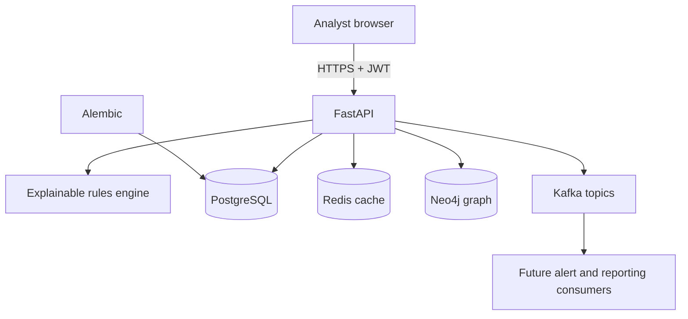
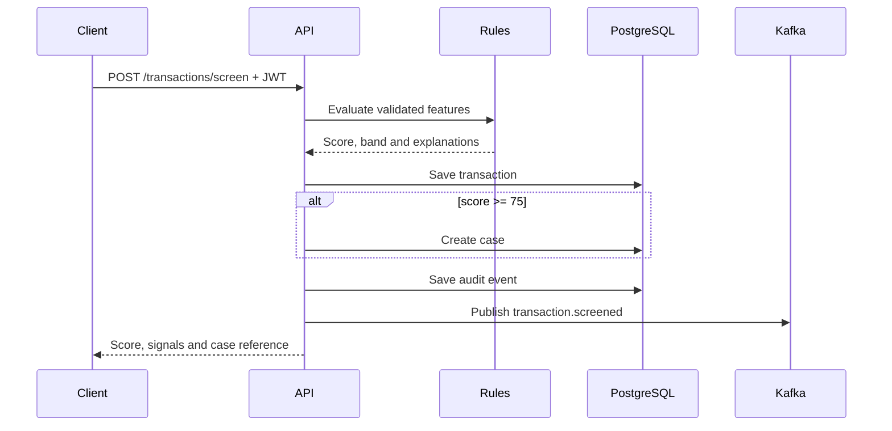

# Northstar architecture

## Service boundaries

The browser talks only to FastAPI. FastAPI validates inputs, enforces JWT authentication and coordinates domain and infrastructure services.

PostgreSQL is the system of record for operational data. Neo4j is a relationship projection used for network traversal and visualization. Redis stores short-lived summaries that can be rebuilt from PostgreSQL. Kafka carries domain events to independent consumers; it is not the system of record.

## Stored data

| Store | Data |
|---|---|
| PostgreSQL | Analysts, transactions, cases, decisions, audit events, event receipts and daily metrics |
| Neo4j | Accounts, devices, beneficiaries and their links |
| Redis | Dashboard summary cache with a short expiry |
| Kafka | `northstar.risk-events` and `northstar.case-events` event streams |

## Transaction screening sequence

The database commit happens before event publication. A Kafka outage therefore does not lose the transaction or analyst record. A separate consumer stores an idempotent receipt for every processed event. A production deployment should add an outbox table and relay worker to guarantee eventual event delivery.

## Case-decision sequence

An authenticated analyst submits a decision and note. The API updates the case and transaction in one database transaction, inserts a separate decision, writes an audit event, invalidates the summary cache and emits a Kafka event.

## Resilience model

The Docker environment expects every dependency. The application also has deliberate degradation behavior for demonstrations:

- Missing Redis disables caching; PostgreSQL remains authoritative.
- Missing Neo4j uses the seeded graph response so investigations remain visible.
- Missing Kafka disables event publication while operational writes continue.
- Missing PostgreSQL falls back only when the application is configured to use SQLite.

The health endpoint exposes the current dependency state.

## Production hardening path

Before processing regulated or customer data, add an external identity provider, TLS termination, managed secrets, field-level encryption, fine-grained roles, maker-checker approval, an event outbox, database backups, centralized telemetry, rate limits, data-retention controls, vulnerability scanning and deployment-specific network policies.
